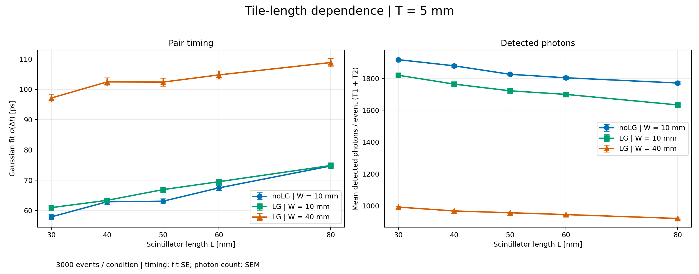
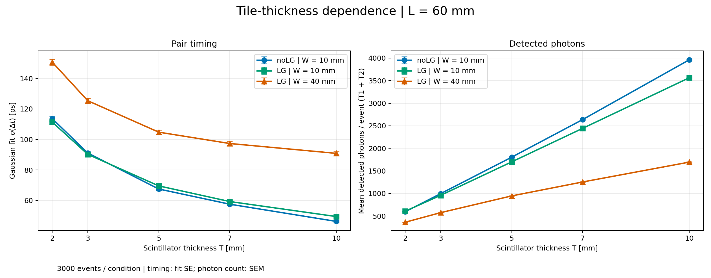

# Length and thickness dependence — 2026-10-07

Central 60 GeV positron pencil beam; two crossed tiles. W10 noLG, W10 LG, W40 LG. Dimensions are full sizes in mm.

- Length L = 30, 40, 50, 60, 80 mm at thickness T = 5 mm.
- Thickness T = 2, 3, 5, 7, 10 mm at length L = 60 mm.
- Shared L60/T5 reference counted once: **27 conditions, 81,000 incident events**.

## Timing and detected photons

Detected photons are the T1 + T2 sum per incident event (mean ± SEM). The timing width is Gaussian σ(T1 − T2), with fit ±1 SE, without division by sqrt(2). Per-trigger counts, incident/valid sample sizes, fit status and Poisson deviance are in [summary.csv](data/summary.csv).

## Geometry interpretation

LG length is 30 mm and its outlet/sensor diameter is 15 mm. The inlet follows tile width × thickness. noLG W10 gel/window/SD use a 9.8 × T mm rectangular coupled region, not the entire circular PMT package. Thus increasing thickness also increases the noLG coupling/detection area. The largest 9.8 × 10 mm rectangle fits inside a centered diameter-15 mm window.

The inter-tile face gap remains 1 mm; center separation grows with thickness. Thickness trends combine photon yield, transport and coupling changes. Length changes the center-to-readout distance. At W40/L30 the crossed area is 30 × 30 mm; at W40/L≥40 it is 40 × 40 mm. The beam remains central.

## Photon production, collection and fates

[Length: photon yield and collection](figures/photon_yield_vs_length.png) · [Thickness: photon yield and collection](figures/photon_yield_vs_thickness.png)

[Length: fate fractions](figures/fate_fractions_vs_length.png) · [Thickness: fate fractions](figures/fate_fractions_vs_thickness.png)

Generated photons include all optical tracks in the event budget (scintillation and Cherenkov), without an origin-volume cut. Collection is the ratio of total detected to total generated photons, with uncertainty from paired event count fluctuations. Other surface includes Al/tape outside the LG-surface category; the ledger does not identify every wrapping material separately.

## Delta-t distributions

| Configuration | Length scan | Thickness scan |
|---|---|---|
| W10 noLG | [Δt panels](figures/dt_length_nolg_w10.png) | [Δt panels](figures/dt_thickness_nolg_w10.png) |
| W10 LG | [Δt panels](figures/dt_length_lg_w10.png) | [Δt panels](figures/dt_thickness_lg_w10.png) |
| W40 LG | [Δt panels](figures/dt_length_lg_w40.png) | [Δt panels](figures/dt_thickness_lg_w40.png) |

ROOT TH1::Fit Gaussian `LQRSNI`, 5 ps bins, full common fit range. Curves use 20001 TF1-evaluated points; data are not smoothed. Frozen SPE rise 1.3 ns/FWHM 3 ns/transit 14 ns, 10 ps waveform sampling, CFD fraction 0.30, local fit half-width 2. Both CFD times must be valid; no LED selection or additional electronics noise/TTS model.

## Documented optical exception

23 original conditions and four 30×100-event replacement conditions are selected. Smoke events, failed original partial runs, and the first c14 attempt are excluded. Seed/event identities are unique within the selected sample.

One photon in LG W10/L40/T5, seed 106600015, event 10, track 9080 terminated as NoRINDEX at the foil-tip-ring → world boundary. The same-seed retry reproduced it. The original strict validation stays FAILED; separate user-approved analysis acceptance retains the event after all other ROOT, primary, count, timing-array, budget and provenance checks pass. No counters were edited and no failed event was silently rerolled.

All 27 fits have status 0 and covariance status 3; 81,000 valid timing pairs. Excluding the one affected event changes this condition’s fitted σ by -0.010315 ps. This is a sample-sensitivity check, not a measurement of the missing photon’s effect. [Details](data/exception-sensitivity.json).

## Reproduction and scope

[Analysis tool](../../tools/length_thickness_trends.py) consumes an audited canonical-event input plan, uses the frozen timing modules named by that plan, and writes ROOT fit objects plus PNGs. [Input provenance](data/input_provenance.json) records selected seeds, counts and ROOT/canonical hashes. [Manifest](manifest.json) records analysis settings, source hashes and output hashes. Raw ROOT/canonical data, local paths, and private research notes are not included in this portable checkpoint.

These results use the frozen September 30 production model and LCG_105/ROOT 6.30 environment. They do not represent the current Geant4 migration branch. Full reproduction requires the archived input plan, data and frozen sources; the figures alone are insufficient.
