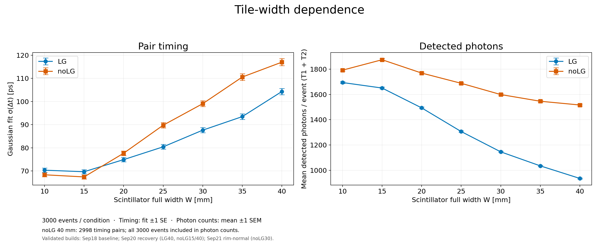
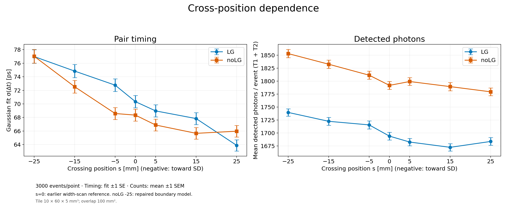
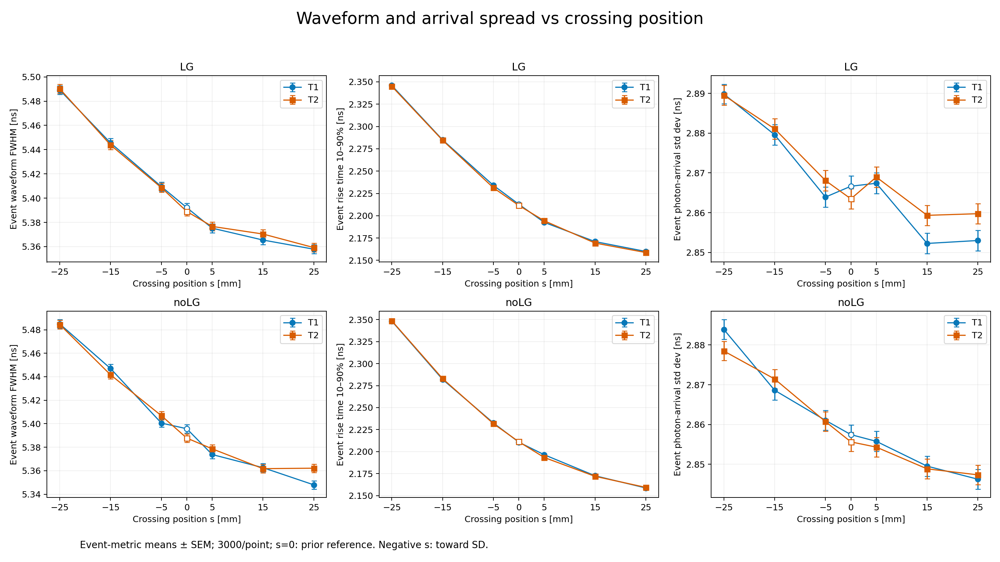
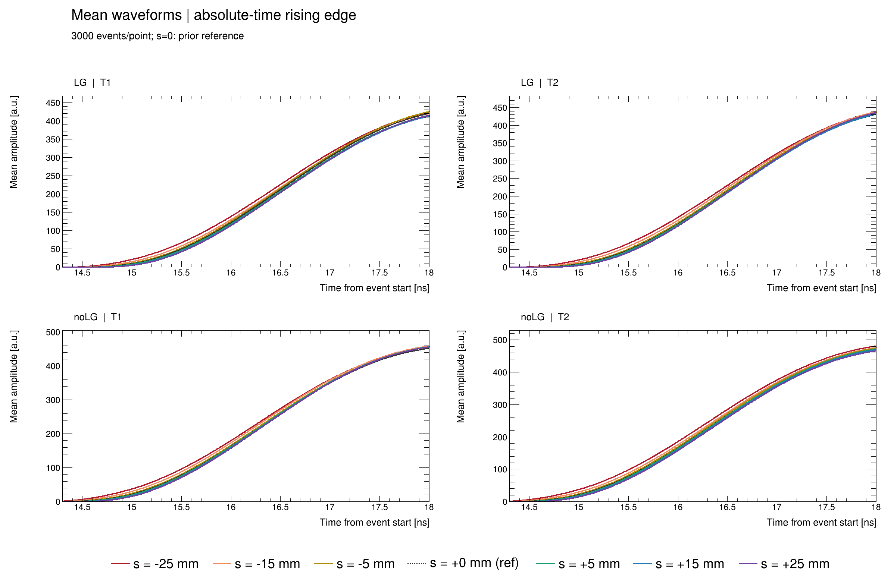

# Tile-width and crossing-position scan checkpoint

Selected results completed through September 28, 2026. Figures are PNG; their exact content hashes are in [manifest.json](manifest.json). This portable snapshot is separate from the private local results portal. Raw ROOT, batch directories and personal research notes are not published here.

## Tile width

Two W×60×5 mm tiles; LG/noLG ×W=10,15,20,25,30,35,40 mm. Each condition has3000 generated events. noLG40 has2998 valid timing pairs due to two out-of-range photon-time cases; photon-count denominators retain all3000.

[40mm Δt distributions](figures/dt_lg_vs_nolg_w40mm.png) · [Gaussian fits](data/tile_width_gaussian_fits.csv) · [Photon fates](data/tile_width_fates.csv)

## Crossing position

Two10×60×5 mm tiles, fixed10×10 mm overlap. Positions s=−25,−15,−5,0,5,15,25 mm; negative is toward the sensor. LG/noLG,3000 events at every point:42000 valid timing pairs. Beam e−60GeV, world origin, +z. Both central samples reuse the approved width-scan W10 data.

[−25mm Δt distributions](figures/dt_lg_vs_nolg_minus25.png) · [Timing and detected counts](data/cross_position_sigma_and_detected.csv) · [Photon fates](data/cross_position_fates.csv)

The repaired noLG−25 condition uses its entire new3000-event sample, not a mixture with old events. Its59,425,460 tracked optical photons have zero NoRINDEX, world exit, unknown or unfinished outcomes, and the optical budget closes. Gaussian σ(Δt)=77.03±1.00ps; LG at that position gives76.98±1.00ps.

## Waveforms

Spread metrics are means of per-event measurements with SEM. The zoom displays the mean waveform on the absolute event-time axis,14.3–18ns, without peak alignment or amplitude normalization. These are different statistics; the small mean-shape differences do not establish the cause of the timing trend. The original28 curves exactly match slices of the cached mean samples.

## Analysis and model scope

- ROOT6.30/02 Gaussian likelihood fits,5ps bins, bin-integrated `LQRSNI`; errors are fit±1SE, no division by√2. All14 fits in each scan passed status0/covariance3.
- Cross-position fits share−0.365..0.285ns. The range expanded with the final sample, so small changes in unchanged-condition fits relative to earlier plots are possible.
- Timing uses ideal SPE rise1.3ns/FWHM3ns/transit14ns,10ps samples,CFD fraction0.3 and local fit half-width2. No new electronics noise or PMT TTS model is implied.
- Detected photons are per-event T1+T2 sums; error bars are SEM. `other_surface` combines Al/tape/seals and is not material-resolved.
- **Production versions are mixed:** width scan uses September18 baseline, September20 recovery for LG40/noLG15/noLG40, and September21 repair for noLG30. Noncentral position samples use the September21 version except noLG−25, which uses the September23 tape-entry patch. Central samples are earlier W10 results.
- The September23 patch is archived in [patches](../../../patches/README.md), not silently applied to the shared simulation. Extreme wafer/window corner stress probes still have a documented pre-existing escape mode. Successful production is not proof of universal optical closure.

Reproduction requires the frozen run manifest and data archive, not these plots alone. This checkpoint does not claim that every condition was generated by the same current source revision.
